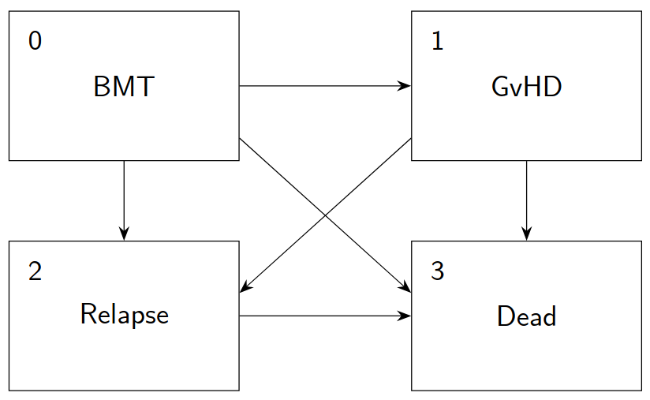

```{r setup, include=FALSE}
knitr::opts_chunk$set(echo = TRUE)
```

## Introduction

This vignette highlights some simple applications of the *JumpForests* package. The package implements trees and random forests for regression, classification, survival, and general multi-state models.
Because the multi-state setting is a novel contribution, we focus on that application here. To install the package, run the following command in R:

```{r install, eval=FALSE}
remotes::install_github("martinbladt/JumpForests", upgrade = "never")
```

We illustrate the package in two settings: a simulated time-inhomogeneous Markov model with one covariate and an analysis of a real dataset.

## A Markov model with independent censoring and covariates

We consider the following simple time-inhomogeneous Markov model with one covariate. This model was also used in the [*AalenJohansen* package vignette](https://cran.r-project.org/web/packages/AalenJohansen/vignettes/AalenJohansen-vignette.html) [@BladtFurrer]:

\[
\frac{\mathrm{d}\Lambda(t|x)}{\mathrm{d}t}=\lambda(t|x)=\frac{1}{1+x\cdot t}
\begin{pmatrix}
-2 & 1 & 1 \\
2 & -3 & 1 \\
0 & 0 & 0
\end{pmatrix}\!.
\]

Here $X \sim \operatorname{Unif}(0,1)$, and the censoring time is independent of the process and follows a $\operatorname{Unif}(0,5)$ distribution. We use the *AalenJohansen* package to simulate $n = 5{,}000$ observations.

```{r sim}
library(AalenJohansen)
library(JumpForests)

set.seed(2026)

jump_rate <- function(i, t, u){
  if(i == 1){
    2
  } else if(i == 2){
    3
  } else{
    0
  }
}

mark_dist <- function(i, s, v){
  if(i == 1){
    c(0, 1/2, 1/2)
  } else if(i == 2){
    c(2/3, 0, 1/3)
  } else{
    0
  }
}

lambda <- function(t, x){
  A <- matrix(c(2/(1+x*t)*mark_dist(1, t, 0), 3/(1+x*t)*mark_dist(2, t, 0), rep(0, 3)),
              nrow = 3, ncol = 3, byrow = TRUE)
  diag(A) <- -rowSums(A)
  A
}

n <- 5000

X <- runif(n)
censoring_times <- runif(n, 0, 5)

sim <- list()
for(i in 1:n){
  rates <- function(j, y, z){jump_rate(j, y, z)/(1+X[i]*y)}
  sim[[i]] <- sim_path(sample(1:2, 1), rates = rates, dists = mark_dist,
                       tn = censoring_times[i],
                       bs = c(2*censoring_times[i], 3*censoring_times[i], 0))
  sim[[i]]$X <- X[i]
}
```

The censoring proportion is

```{r cens}
sum(censoring_times == unlist(lapply(sim, FUN = function(z){tail(z$times, 1)}))) / n
```

In order to fit the jump forest below, we need to separate the covariates from the jump data.

```{r data}
feature_data <- data.frame(X = X)
```

The jump data must be a list with one element per observation. Each element must itself be a list containing elements named `times` and `states`; any additional elements are ignored.

### Fitting a jump forest

When fitting a jump forest, relevant tuning hyperparameters are:

* `min_node_size`: The minimum number of observations allowed in a terminal node.
* `splitrule`: The splitting rule to apply. Six are currently implemented: `logrank` (the default), `gehan`, `taroneware`, `approxlogrank`, `petoprentice`, and `flemingharrington`. The last rule accepts additional parameters through `fh_weights_a` and `fh_weights_b`.
* `max_depth`: The maximum allowed depth of a tree.
* `mtry`: The number of candidate covariates considered at each split. By default, this is the smallest integer greater than or equal to the square root of the number of covariates.
* `nsplits`: The number of split points sampled for each covariate when determining the best split. The default is 10.
* `ntrees`: The number of trees in the forest. The default for multi-state forests is 500.
* `swr`: Whether to sample with replacement. The default is `FALSE`.
* `sample_rate`: A number in $(0,1]$ specifying the fraction of observations in each subsample. The default is 0.7 when `swr = FALSE` and 1.0 otherwise (the classical Efron bootstrap).

There are also hyperparameters specific to `honest` trees and forests, but for brevity, we do not cover them here. We tune only the first five splitting rules and several minimum node sizes. In our experience, these are among the most important hyperparameters to tune.
To assess prediction error, we use the forest's internal out-of-bag (OOB) error estimates. The forest reports three error types, all based on predicted occupation probabilities. For simplicity, we consider only the integrated Brier score (IBS).

```{r tune, eval=TRUE, echo=TRUE, results='hide'}

min_node_sizes <- c(25, 50, 75, 100, 125, 150, 175, 200, 250, 300)
split_rules <- c("logrank", "gehan", "taroneware", "approxlogrank", "petoprentice")
num_min_node_sizes <- length(min_node_sizes)
num_split_rules <- length(split_rules)

ibs <- matrix(rep(0, num_min_node_sizes * num_split_rules), nrow = num_split_rules)

for (i in seq_len(num_split_rules)) {
    for (j in seq_len(num_min_node_sizes)) {
        fitted_forest <- jfforest(MM ~ ., data = sim, feature_data = feature_data, splitrule = split_rules[i],
                                  min_node_size = min_node_sizes[j], seed = 2026, num_event_times = 500)
        ibs[i, j] <- fitted_forest$ibs.normalised

        # free memory when a forest is no longer used
        rm("fitted_forest")
        gc()

        cat("Finished fitting forest", (i - 1) * num_min_node_sizes + j, "out of", num_min_node_sizes * num_split_rules, "\n")
    }
}
```

```{r tuneresults}
ibs
which(ibs == min(ibs), arr.ind = TRUE)[1, ]
```

The following code plots the IBS curve for each splitting rule.

```{r tune-plot, eval=TRUE}
split_rule_colours <- seq_along(split_rules)
split_rule_linetypes <- seq_along(split_rules)
matplot(
  min_node_sizes, t(ibs),
  type = "l", lwd = 2,
  col = split_rule_colours, lty = split_rule_linetypes,
  xlab = "Minimum node size", ylab = "Normalised OOB IBS"
)
legend(
  "topright", legend = split_rules,
  col = split_rule_colours, lty = split_rule_linetypes,
  lwd = 2, bty = "n"
)
```

Approximate log-rank splitting with a minimum node size of 250 performs best. This leads to quite shallow trees, which is not surprising. With only one covariate, the data-generating mechanism is not very complex, and the increased stability of shallow trees may outweigh the potential reduction in bias from growing deeper trees. We now fit the final forest.

```{r fit}
forest <- jfforest(MM ~ ., data = sim, feature_data = feature_data, splitrule = "approxlogrank",
                   min_node_size = 250, seed = 2026, save_predictions = FALSE)
```

Note the option `save_predictions = FALSE`. This means that the training-set and OOB predictions are not saved and, in particular, that the internal error estimates are not computed.
This saves a significant amount of time and memory, while predictions for new observations can still be computed. The `print_forest` function displays information about the fitted forest:

```{r info}
print_forest(forest)
```

If `save_predictions` were set to `TRUE` (the default), `print_forest` would also provide an error summary based on OOB data.

Finally, some remarks on tuning in general:

* Fitting a jump forest can be memory-intensive. One way to reduce memory use is to tune on a subsample of the data, which seems to work well for determining the optimal splitting rule. Be wary when selecting the minimum node size, however; see the next point.
* In our experience, setting `min_node_size` slightly above the square root of the number of observations works well. We recommend tuning values near this number and avoiding very small minimum node sizes.
* An effective way to reduce computation time and memory use is to limit the number of event times used by the forest through `num_event_times`. With continuous data, the number of distinct event times can grow rapidly with $n$. In our experience, reducing `num_event_times` to 1,000 or even 500 has little effect on performance.

Regarding the last point, the number of event times (including censoring times) in the $n = 5{,}000$ sample used above is

```{r thin}
length(unique(unlist(lapply(sim, function(z) z$times))))
```

This is a large number, so reducing the number of event times to 500, as above, or even lower is highly recommended.

### Comparing with the conditional Aalen-Johansen estimator

We compare the jump forest with the conditional Aalen-Johansen estimator, another relatively recent non-parametric method for multi-state models. We consider three values of $X$: 0.2, 0.6, and 0.8. Predictions for new data are obtained with `jfforest.predict` as follows:

```{r forestfit}
x1 <- 0.2
x2 <- 0.6
x3 <- 0.8
new_data <- data.frame(X = c(x1, x2, x3))
forest_fit <- jfforest.predict(forest, new_data, compute_initial = TRUE)
```

The option `compute_initial = TRUE` means that the initial distribution is also estimated in each terminal node. The following code fits the conditional Aalen-Johansen estimator and plots the predicted cumulative hazards and occupation probabilities for state 2.
We show $x = 0.2$ in red, $x = 0.6$ in blue, and $x = 0.8$ in green. Dashed lines show estimates, while solid lines show the true values.

```{r compare, fig.width=10, fig.height=8}
fit1 <- aalen_johansen(sim, x = x1)
fit2 <- aalen_johansen(sim, x = x2)
fit3 <- aalen_johansen(sim, x = x3)

# compute the predictions from the conditional Aalen-Johansen estimator
v11 <- unlist(lapply(fit1$Lambda, FUN = function(L) L[2,1]))
v10 <- fit1$t
v21 <- unlist(lapply(fit2$Lambda, FUN = function(L) L[2,1]))
v20 <- fit2$t
v31 <- unlist(lapply(fit3$Lambda, FUN = function(L) L[2,1]))
v30 <- fit3$t
p1 <- unlist(lapply(fit1$p, FUN = function(L) L[2]))
P1 <- unlist(lapply(prodint(0, 5, 0.01, function(t){lambda(t, x = x1)}),
FUN = function(L) (c(1/2, 1/2, 0) %*% L)[2]))
p2 <- unlist(lapply(fit2$p, FUN = function(L) L[2]))
P2 <- unlist(lapply(prodint(0, 5, 0.01, function(t){lambda(t, x = x2)}),
FUN = function(L) (c(1/2, 1/2, 0) %*% L)[2]))
p3 <- unlist(lapply(fit3$p, FUN = function(L) L[2]))
P3 <- unlist(lapply(prodint(0, 5, 0.01, function(t){lambda(t, x = x3)}),
FUN = function(L) (c(1/2, 1/2, 0) %*% L)[2]))

# compute the predictions from the random forest
times <- forest$unique.event.times
v11_forest <- unlist(lapply(forest_fit[[1]][[1]], FUN = function(L) L[2,1]))
v21_forest <- unlist(lapply(forest_fit[[1]][[2]], FUN = function(L) L[2,1]))
v31_forest <- unlist(lapply(forest_fit[[1]][[3]], FUN = function(L) L[2,1]))

# compute RF occupation probabilities for state 2
p1_forest <- unlist(lapply(occupation_prob(init = forest_fit[[2]][[1]], na = forest_fit[[1]][[1]]), FUN = function(L) L[2]))
p2_forest <- unlist(lapply(occupation_prob(init = forest_fit[[2]][[2]], na = forest_fit[[1]][[2]]), FUN = function(L) L[2]))
p3_forest <- unlist(lapply(occupation_prob(init = forest_fit[[2]][[3]], na = forest_fit[[1]][[3]]), FUN = function(L) L[2]))

# plot options
par(mfrow = c(2, 2))
par(mar = c(2.5, 2.5, 1.5, 1.5))

# cumulative hazard for the transition from 2 to 1 (cAJ)
plot(v10, v11, type = "l", lty = 2, xlab = "", ylab = "", main = "Cumulative hazard (cAJ)", col = "red", xlim = c(0, 5), ylim = c(0, 4))
lines(v10, 2/x1*log(1+x1*v10), col = "red")
lines(v20, v21, lty = 2, col = "blue")
lines(v20, 2/x2*log(1+x2*v20), col = "blue")
lines(v30, v31, lty = 2, col = "darkgreen")
lines(v30, 2/x3*log(1+x3*v30), col = "darkgreen")

# occupation probability for state 2 (cAJ)
plot(v10, p1, type = "l", lty = 2, xlab = "", ylab = "", main = "Probability (cAJ)", col = "red")
lines(seq(0, 5, 0.01), P1, col = "red")
lines(v20, p2, lty = 2, col = "blue")
lines(seq(0, 5, 0.01), P2, col = "blue")
lines(v30, p3, lty = 2, col = "darkgreen")
lines(seq(0, 5, 0.01), P3, col = "darkgreen")

# cumulative hazard for the transition from 2 to 1 (RF)
plot(times, v11_forest, type = "l", lty = 2, xlab = "", ylab = "", main = "Cumulative hazard (RF)", col = "red", xlim = c(0, 5), ylim = c(0, 4))
lines(times, 2/x1*log(1+x1*times), col = "red")
lines(times, v21_forest, lty = 2, col = "blue")
lines(times, 2/x2*log(1+x2*times), col = "blue")
lines(times, v31_forest, lty = 2, col = "darkgreen")
lines(times, 2/x3*log(1+x3*times), col = "darkgreen")

# occupation probability for state 2 (RF)
plot(times, p1_forest, type = "l", lty = 2, xlab = "", ylab = "", main = "Probability (RF)", col = "red", xlim = c(0, 5), ylim = c(0, 0.7))
lines(seq(0, 5, 0.01), P1, col = "red")
lines(times, p2_forest, lty = 2, col = "blue")
lines(seq(0, 5, 0.01), P2, col = "blue")
lines(times, p3_forest, lty = 2, col = "darkgreen")
lines(seq(0, 5, 0.01), P3, col = "darkgreen")
```

In this example, the jump-forest estimates appear more precise and stable than those from the conditional Aalen-Johansen estimator.

## Illustration on real data: the `bmt` dataset

We illustrate the package using the [`bmt` dataset](https://multi-state-book.github.io/companion/), described by @AndersenRavn. This study comprises 2,009 patients who underwent bone marrow transplantation (the initial state).
After treatment, patients could experience graft-versus-host disease (GvHD; state 1), relapse (state 2), or death (state 3). The multi-state model is illustrated below.

```{r bmt-figure, echo=FALSE, out.width="50%", fig.align="center", fig.cap="The multi-state structure of the BMT data."}

```

An important question is how GvHD affects the risks of relapse and death. To fit the model, we extract the jump data as follows:

```{r bmtprep}
bmt <- read.csv("https://multi-state-book.github.io/companion/data/bmt.csv")

jump_data <- list()
for (i in seq_len(nrow(bmt))) {
    patient <- as.numeric(bmt[i, ])
    times <- numeric()
    states <- integer()

    if (patient[8] == 1) {
        # the path is 0->1->2->3
        if (patient[6] == 1) {
            times <- c(0.0, patient[7], patient[5], patient[3])
            states <- c(1L, 2L, 3L, 4L)
        # the path is 0->1->3
        } else {
            times <- c(0.0, patient[7], patient[3])
            states <- c(1L, 2L, 4L)
        }
    } else {
        # the path is 0->2->3
        if (patient[6] == 1) {
            times <- c(0.0, patient[5], patient[3])
            states <- c(1L, 3L, 4L)
        # the path is 0->3
        } else {
            times <- c(0.0, patient[3])
            states <- c(1L, 4L)
        }
    }

    # JumpForests requires strictly increasing times
    for (j in rev(which(diff(times) == 0))) {
        times[j] <- times[j + 1] - 1e-8
    }

    # make the last state a repetition of the previous one in case of censoring
    if (patient[4] == 0) {
        states[length(states)] <- states[length(states) - 1]
    }

    # finally, update jump_data
    jump_data[[i]] <- list(times = times, states = states)
}
```

The figure uses state labels 0--3, whereas the code uses the equivalent one-based labels 1--4 expected by *JumpForests*.

We remove the `team` variable because it has 255 levels. This leaves four covariates: `sex`, `age`, `all`, and `bmonly`.

```{r bmtfeatures}
feature_data <- bmt[, c("sex", "age", "all", "bmonly")]
```

Using the same tuning procedure as in the synthetic example (results not shown), we find that `min_node_size = 100` with `splitrule = "approxlogrank"` works best. We then fit the final forest.

```{r bmtfit}
fitted_forest <- jfforest(
    MM ~ ., data = jump_data, feature_data = feature_data,
    splitrule = "approxlogrank", min_node_size = 100,
    seed = 2026, num_event_times = 1000
)
```

The forest summary includes the integrated Brier score (IBS), integrated Kullback-Leibler score (IKL), integrated spherical score (IS), and their normalised versions.

```{r printbmtforest}
print_forest(fitted_forest)
```

An interesting application of jump forests is variable selection. The *JumpForests* package computes variable importance (VIMP) using either permuted feature values or random daughter assignment. The following calls compute Brier-score VIMP using both methods:

```{r bmtvimp}
unlist(jfforest.vimp(fitted_forest, method = "random", loss = "brier")$vimp)
unlist(jfforest.vimp(fitted_forest, method = "permute", loss = "brier")$vimp)
```

The first line uses random daughter assignment, while the second uses permuted feature values. To assess the variability of the resulting importance values, we repeat the calculation 100 times. To reduce computation, we use only random daughter assignment.

```{r bmtvimp100, cache=TRUE}
vimp_bmt <- as.data.frame(t(sapply(seq_len(100), function(i) {
    unlist(jfforest.vimp(fitted_forest, seed = i, method = "random", loss = "brier")$vimp)
})))
names(vimp_bmt) <- names(feature_data)
write.table(vimp_bmt, "vimp_bmt.txt", sep = "\t", row.names = FALSE)
```

```{r bmtvimp100plot, fig.width=10, fig.height=6}
library(ggplot2)

plot_vimp <- function(vimp_table) {
    plot_data <- stack(vimp_table)
    names(plot_data) <- c("vimp", "covariate")
    plot_data$covariate <- reorder(plot_data$covariate, plot_data$vimp, median)
    covariates <- levels(plot_data$covariate)
    fill_colours <- setNames(hcl.colors(length(covariates), "Dark 3"), covariates)

    ggplot(plot_data, aes(x = covariate, y = vimp, fill = covariate)) +
        geom_boxplot(width = 0.7, outlier.shape = 21, outlier.fill = "white",
                     outlier.size = 1.7) +
        geom_hline(yintercept = 0, colour = "grey35", linewidth = 0.4) +
        coord_flip() +
        scale_fill_manual(values = fill_colours) +
        labs(title = "Random Brier VIMP", x = NULL, y = "VIMP") +
        guides(fill = guide_legend(nrow = 1, byrow = TRUE)) +
        theme_bw() +
        theme(legend.position = "bottom", legend.title = element_blank(),
              plot.title = element_text(hjust = 0.5))
}

plot_vimp(vimp_bmt)
```

The plot suggests that `age` is the most important covariate, followed by `bmonly` and `all`, while the importance of `sex` is near zero. To further illustrate VIMP, we add ten $\mathcal{N}(0,1)$ noise variables to the feature data, refit the forest, and repeat the VIMP calculation 100 times.

```{r bmtvimp100noise, cache=TRUE}
set.seed(2026)
noise <- as.data.frame(matrix(rnorm(nrow(feature_data) * 10), ncol = 10))
names(noise) <- paste0("N", 1:10)
feature_data_noise <- cbind(feature_data, noise)

fitted_forest_noise <- jfforest(
    MM ~ ., data = jump_data, feature_data = feature_data_noise,
    splitrule = "approxlogrank", min_node_size = 100,
    seed = 2026, num_event_times = 1000
)

vimp_bmt_noise <- as.data.frame(t(sapply(seq_len(100), function(i) {
    unlist(jfforest.vimp(fitted_forest_noise, seed = i, method = "random", loss = "brier")$vimp)
})))
names(vimp_bmt_noise) <- names(feature_data_noise)
write.table(vimp_bmt_noise, "vimp_bmt_noise.txt", sep = "\t", row.names = FALSE)
```

```{r bmtvimp100noiseplot, fig.width=10, fig.height=6}
plot_vimp(vimp_bmt_noise)
```

As expected, the VIMP values of all noise variables are concentrated around zero. The importance ranking of the original covariates is also unchanged.

## References
